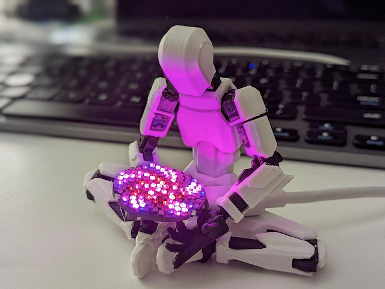

# Fibonacci128 Touch Demo

Arduino firmware for One Inch Fibonacci128 with touch pads

More info: [One Inch Fibonacci128](https://www.evilgeniuslabs.org/one-inch-fibonacci128)

### Updating your 1" Fibonacci128:

1. Connect your 1" Fibonacci128 to a computer with a USB-C cable.
2. Double-click the button on the back of the 1" F128. The light on the back should turn green, and a `QTPY_BOOT` drive should appear on your computer.
3. Download and drag (or copy and paste) the [1f128.uf2](1f128.uf2) file onto the `QTPY_BOOT` drive.
4. You may need to reset the 1" F128 by clicking the button on the back, or disconnect and reconnect the USB cable.

### Dependencies

I developed and tested this sketch with the following board and library versions. The sketch may work with other versions, but these are known to work.

Board: Adafruit QT Py (SAMD21) 
* Adafruit SAMD Boards version 1.7.5
* https://adafruit.github.io/arduino-board-index/package_adafruit_index.json

Libraries:
* FastLED v3.5.0: https://github.com/FastLED/FastLED
* Adafruit FreeTouch Library v1.1.1: https://github.com/adafruit/Adafruit_FreeTouch
