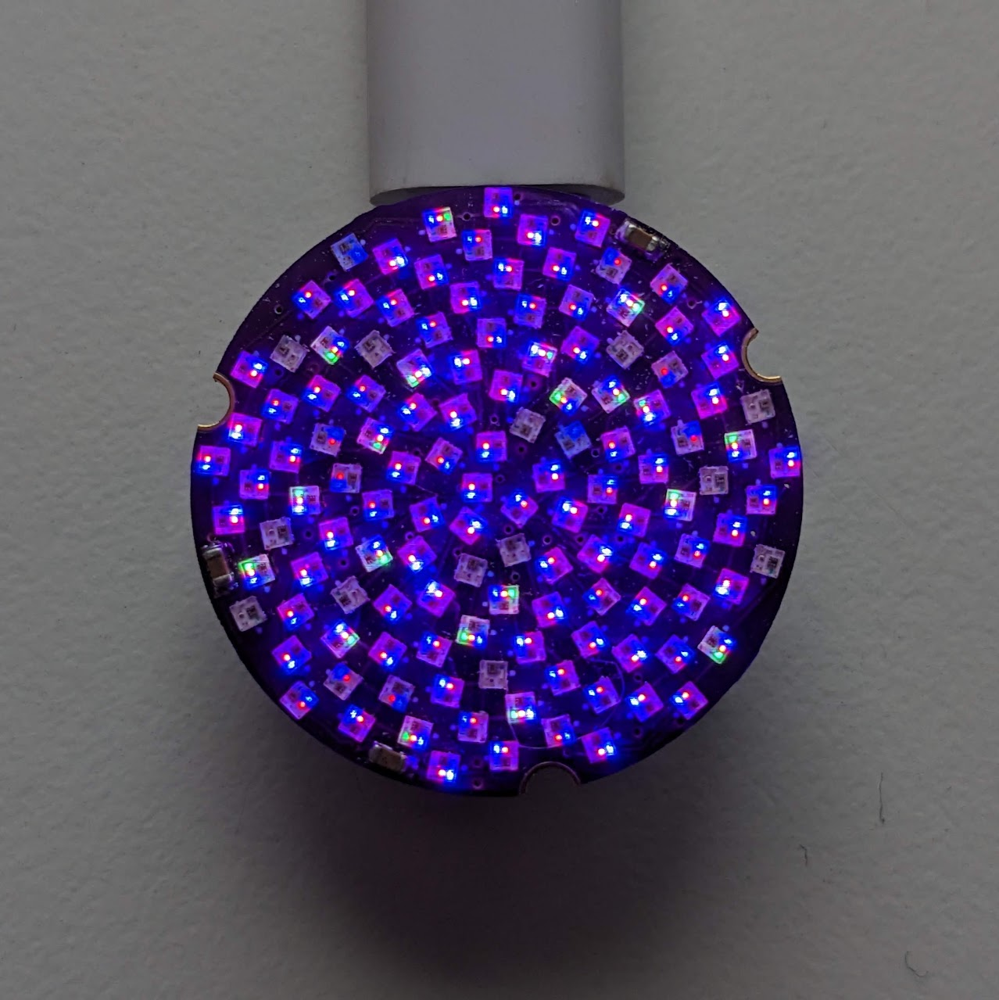

# Fibonacci128 Touch Demo

Demo Arduino firmware for One Inch Fibonacci128 with touch pads

More info: [One Inch Fibonacci128](https://www.evilgeniuslabs.org/one-inch-fibonacci128)

### Dependencies

I developed and tested this sketch with the following board and library versions. The sketch may work with other versions, but these are known to work.

Board: Adafruit QT Py (SAMD21) 
* Adafruit SAMD Boards version 1.7.5
* https://adafruit.github.io/arduino-board-index/package_adafruit_index.json

Libraries:
* FastLED v3.5.0: https://github.com/FastLED/FastLED
* Adafruit FreeTouch Library v1.1.1: https://github.com/adafruit/Adafruit_FreeTouch